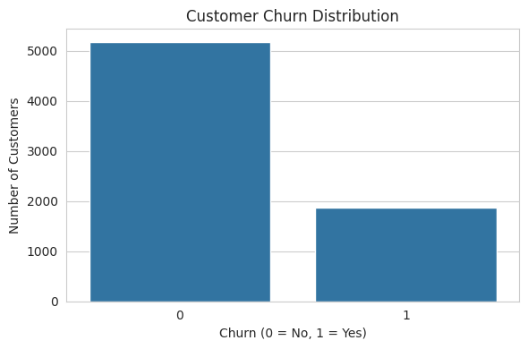
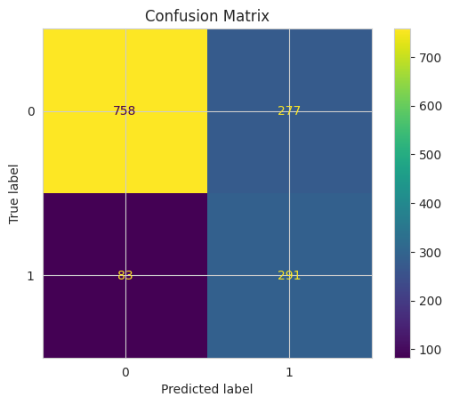

# 📊 Customer Churn Prediction & Retention Risk Analysis

## 📌 Overview

This project analyzes customer churn behavior using logistic regression modeling and business-focused evaluation techniques. The objective is to identify high-risk customers and provide actionable retention strategies.

The dataset contains 7,043 customers with a churn rate of 26.5%.

---

## 🎯 Objectives

- Identify key churn drivers
- Build a predictive classification model
- Address class imbalance
- Evaluate model performance using recall and AUC
- Provide business-oriented retention recommendations

---

## 🛠 Tools & Technologies

- Python  
- Pandas  
- Scikit-learn  
- Matplotlib  
- Logistic Regression  
- Pipeline preprocessing (imputation, scaling, encoding)

---

## 📊 Model Performance

| Metric | Value |
|--------|--------|
| Accuracy | 74.4% |
| Churn Recall | 78% |
| AUC Score | 0.849 |

The baseline model achieved 80% accuracy but only captured 57% of churners.  
After applying class weighting and proper preprocessing, recall improved to 78%, significantly enhancing business value.

---

## 🔍 Key Churn Drivers

### Increased Churn Risk
- Fiber optic internet service
- Higher total customer charges
- Electronic check payment method
- Streaming service add-ons
- Paperless billing enrollment

### Reduced Churn Risk
- Two-year and one-year contracts
- Longer tenure
- Customers with dependents
- Online security and tech support subscriptions

---

## 📈 Visualizations

### Churn Distribution

### Confusion Matrix

### ROC Curve

